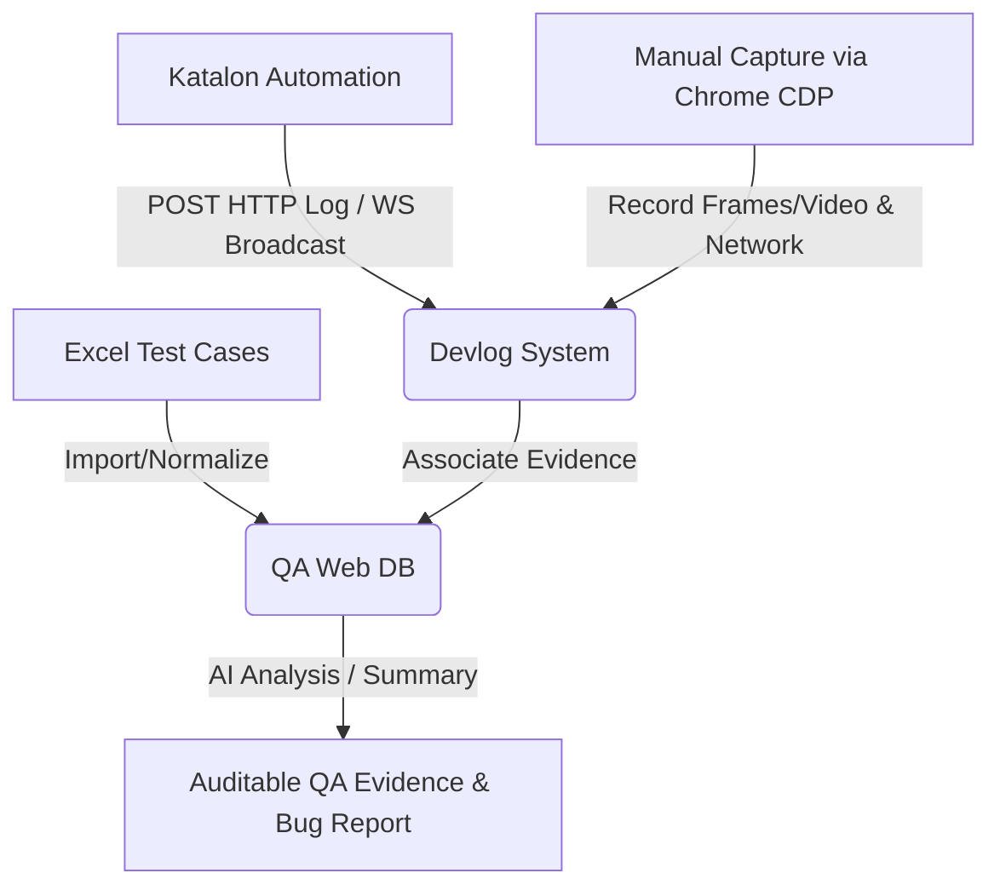

# QA-Web Project Onboarding & Handover Documentation

This documentation serves as a comprehensive onboarding guide for a Senior Software Engineer joining the **QA-Web** (QA Desk) project. It details the product purpose, architecture, codebase structures, external systems (WebSocket/CDP/AI), data flows, technical debt, and future roadmap, allowing you to assume full engineering ownership of the system immediately.

---

## 1. Executive Summary

### What the Project Is
**QA-Web** is a unified, locally deployed Quality Assurance workbench. It functions as a central hub for managing projects, modules, test cases, and bug fixes, combined with automated execution logging and browser-level capture.

### Why it Exists
Manual testing and automated testing often suffer from siloed evidence. When a test fails, developers and QA leads struggle to inspect the root cause. This project exists to unify:
* Traditional test cases and bug lists.
* Automated execution logs (e.g., from Katalon Studio).
* Real-time manual execution captures (browser console logs, API traffic, and keyframe/video evidence).
* AI-driven test case generation and execution trace summaries.

### Who Uses It
* **QA Engineers**: To import test cases, perform manual/automated testing with embedded evidence logs, and report bugs.
* **Software Developers**: To inspect visual recording evidence, browser errors, and network API payloads of reported bugs.
* **QA Leads / Managers**: To monitor project-wide status, verify bug fixes, and review AI summaries of test executions.

### Main Business Goals
* **Traceable Evidence**: Zero-overhead video and network capture for bug reporting.
* **Faster Debugging**: Immediate access to console logs and request payloads next to test steps.
* **Accelerated QA Cycles**: AI-assisted test creation and automated import/export pipelines.

### Main Workflows


---

## 2. Product Overview

### 1. Dashboard Module
* **Purpose**: Provides a high-level statistical overview of the selected project.
* **User Flow**: Selected upon opening the app. Users view status cards, success/failure charts, and priorities.
* **Inputs**: Project ID filter, Module filter.
* **Outputs**: Line charts, progress bars, aggregate stats (Total Test Cases, Automation Level, Resolved Bugs).
* **Dependencies**: [stats-aggregation.ts](../src/lib/services/stats-aggregation.ts).

### 2. Projects Module
* **Purpose**: Organizes test cases, modules, and knowledge items into separate project scopes.
* **User Flow**: Top navigation lets users switch, create, or modify projects.
* **Inputs**: Project name, description, and optional automation context metadata (used by the AI prompt engine).
* **Outputs**: Database entries in `Project` table.
* **Dependencies**: [use-projects.ts](../src/hooks/use-projects.ts).

### 3. Test Cases Module
* **Purpose**: The primary entity registry for test plans.
* **User Flow**: Users view a sortable list of test cases, search by keywords, filter by module/status/priority, edit steps/expected results, and view logs.
* **Pagination UX**: The table now defaults to 10 rows per page and exposes a row-count dropdown for 10, 25, 50, or 100 rows. Changing the page size resets the table back to page 1 to avoid empty pages.
* **Inputs**: Description, steps, page, sub-menu, weight, priority, and actual results.
* **Outputs**: SQLite updates in `TestCase` table.
* **Dependencies**: [use-testcases.ts](../src/hooks/use-testcases.ts) and [TestCaseTable.tsx](../src/components/TestCaseTable.tsx).

### 4. Bug Fixes Module
* **Purpose**: Tracks defects directly linked back to failing source test cases.
* **User Flow**: When a test case is marked FAILED, a user can generate a Bug Fix item, which clones the metadata and tracks the state (Reported, Fixing, Retesting, Verified).
* **Inputs**: Source test case ID, developer remarks, status transition.
* **Outputs**: SQLite entries in `BugFix` table.
* **Dependencies**: [use-bugfixes.ts](../src/hooks/use-bugfixes.ts) and [BugFixPanel.tsx](../src/components/BugFixPanel.tsx).

### 5. AI Features Module
* **Purpose**: Provides automated test case generation and copilot chats.
* **User Flow**: (1) Gated behind `FEATURES.aiTestcaseFlows`. Users input a feature description or URL, select a module, and the AI returns draft test cases. (2) Generates a natural language summary of execution traces.
* **Inputs**: User prompt, database context, relevant knowledge documents.
* **Outputs**: Multi-case JSON arrays parsed and inserted into the DB; execution summaries.
* **Dependencies**: [ai-provider.ts](../src/lib/ai-provider.ts) and [ai-context.ts](../src/lib/ai-context.ts).

### 6. Excel Import/Export Module
* **Purpose**: Bi-directional integration with standard Excel test templates.
* **User Flow**: Users download a template or upload an existing Excel sheet to populate or update the test suite database.
* **Current UX Note**: The import preview dialog is constrained to 90vh, with a scrollable body and fixed footer so the confirmation button remains reachable after large previews.
* **Inputs**: File upload (.xlsx).
* **Outputs**: Parsed and validated SQLite records; downloaded Excel sheets with styles.
* **Dependencies**: `exceljs`, `xlsx`, and [excel-import-service.ts](../src/lib/services/excel-import-service.ts).

### 7. Automation & Devlog System
* **Purpose**: Streams execution steps and network calls in real time.
* **User Flow**: A user runs Katalon tests or clicks "Start Capture" on a manual test case. The page updates live with traces.
* **Current Contract**: Manual Capture and Katalon Capture remain separate capture layers, but both converge into `AutomationEventV1` before reaching the frontend.
* **Inputs**: HTTP POST logs on port 3001; Chrome DevTools Protocol events.
* **Outputs**: Legacy `/log` messages, normalized `automation.event` WebSocket envelopes, and stored JSONL files that preserve backward-compatible payloads.
* **Dependencies**: [ws-server.js](../mini-services/ws-server.js), [automation-event.js](../mini-services/automation-event.js), [automation-event-client.ts](../src/lib/client/automation/automation-event-client.ts), and [useAutomationLogs.ts](../src/hooks/useAutomationLogs.ts).

### 8. Evidence Module
* **Purpose**: Generates standalone, self-contained HTML documents of execution runs.
* **User Flow**: User clicks "Export Evidence" on a test case. The system bundles logs, network tables, and visual screenshots as Base64 into a downloadable HTML document.
* **Inputs**: Test Case ID.
* **Outputs**: Standalone HTML attachment download.
* **Dependencies**: [route.ts](../src/app/api/evidence/route.ts).

---

## 3. User Roles & Permissions

Because this workspace functions as a local desktop-based workspace (stored locally on developer/QA machines):

* **Single Role (Administrator/QA-Owner)**: All operations run locally. There is no multi-tenant permission layer or server-side RBAC (Role-Based Access Control) in the codebase.
* **Privileges**: Users have full read/write access to the SQLite database, local filesystem storage (`%LOCALAPPDATA%`), local port 3001 execution (CDP browser spawning), and environment configurations.
* **Future Extension Note**: If migrated to a multi-user cloud setup, a middleware auth check must be added to route handlers under `src/app/api/` and WebSocket boundaries.

---

## 4. Architecture Overview

QA-Web employs a clean, layered architecture designed to isolate concerns and enforce testability.

```
┌────────────────────────────────────────────────────────┐
│                     FRONTEND LAYER                     │
│  [page.tsx] ──► [React Components] ──► [Custom Hooks] │
└──────────────────────────┬─────────────────────────────┘
                           │ HTTP Requests
┌──────────────────────────▼─────────────────────────────┐
│                    API ROUTE HANDLERS                  │
│       [src/app/api/*] (Next.js Edge/Stand-alone)       │
└──────────────────────────┬─────────────────────────────┘
                           │ Direct Service Invocation
┌──────────────────────────▼─────────────────────────────┐
│                      SERVICE LAYER                     │
│      [src/lib/services/*] (Database, Excel, Sync)     │
└──────────┬───────────────────────────────┬─────────────┘
           │ Imports                       │ Queries
┌──────────▼───────────────┐     ┌─────────▼─────────────┐
│       DOMAIN LAYER       │     │     DATABASE (ORM)    │
│  [src/lib/domain/*]      │     │  [Prisma client]      │
│  (Constants, Transition) │     │  (SQLite Database)    │
└──────────────────────────┘     └───────────────────────┘
```

### Frontend Details
* **Pages**: `src/app/page.tsx` is the primary orchestrator that sets up layouts, sidebar navigation, dialog wiring, and mounts dashboard/test/bug/setting panels.
* **Components**: Shared shadcn-based components reside in `src/components/` and raw primitive styling elements in `src/components/ui/`.
* **Hooks**: Custom hooks under `src/hooks/` capture local state (e.g., [use-testcases.ts](../src/hooks/use-testcases.ts) encapsulates search, filtering, and database mutations).
* **Client API Layer**: Located under `src/lib/client/api/`. These modules contain typed, fetch-based clients (e.g., `projects-client.ts`, `testcases-client.ts`) communicating with backend routes.

### Backend Details
* **API Routes**: Next.js App Router routes at `src/app/api/`. They parse request bodies and invoke the corresponding service modules.
* **Services**: Isolated, framework-independent JavaScript modules under `src/lib/services/` (e.g., stats calculations, Excel parsers). They handle business logic.
* **Domain Layer**: Pure constants and functions in `src/lib/domain/` describing statuses (e.g., `TESTCASE_STATUSES`, `BUGFIX_STATUSES`), test types, and priorities.

### Database Details
* **Database engine**: SQLite, selected for its zero-configuration local portability.
* **Prisma schema**: [schema.prisma](../prisma/schema.prisma) defines:
  * `Project` (1-to-many with `TestCase`, `BugFix`, `Module`, `ProjectKnowledge`).
  * `TestCase` (Contains logs, remarks, steps, links to `BugFix` models).
  * `BugFix` (Maintains source test case linkage).
  * `ProjectKnowledge` (Store for context-aware AI prompting rules).

### External Integrations
1. **AI Services**: Consumed via [ai-provider.ts](../src/lib/ai-provider.ts). Integrates with Groq (via SDK), Gemini (via Google's REST API endpoint), and Ollama (local model serving).
2. **WebSocket Relay**: Runs on port 3001 using the `ws` package. Used for real-time console/network log streaming.
3. **Browser Remote Debugging**: Spawns Chrome/Edge windows using Chrome DevTools Protocol (CDP) commands.
4. **ffmpeg**: Bundled via `@ffmpeg-installer/ffmpeg` (fallback to system `ffmpeg` binary). Used to record manual testing sequences directly into WebM videos.
5. **Excel Parsing**: Handled via `exceljs` and `xlsx` for template styling and row normalization.

---

## 5. Source Code Structure

Here is the functional breakdown of the key directories:

### Root Folders

* **`prisma/`**
  * **Responsibility**: Database schema definition and migration tracking.
  * **Key Files**: [schema.prisma](../prisma/schema.prisma) (database layout) and `dev.db` (local SQLite binary, gitignored).
* **`mini-services/`**
  * **Responsibility**: Local relay server orchestrating real-time streaming, CDP capture sessions, and video rendering.
  * **Key Files**: [ws-server.js](../mini-services/ws-server.js) (large event loop/WS socket handler).
  * **Dependencies**: `ws`, `sharp`, `@ffmpeg-installer/ffmpeg`.
* **`docs/`**
  * **Responsibility**: Groovy templates for Katalon integration and technical guidebooks.
  * **Key Files**: [devlogs-user-technical-explanation.txt](../docs/devlogs-user-technical-explanation.txt) and Katalon helper groovy scripts.

### `src/` directory

* **`src/app/`**
  * **Responsibility**: Next.js App routing layout, main page components, and Next.js backend API routes.
  * **Key Files**:
    * `page.tsx` (Root UI layout and tab mounts).
    * `api/testcases/route.ts` (Handles CRUD mutations).
    * `api/evidence/route.ts` (Assembles HTML standalone trace sheets).
* **`src/components/`**
  * **Responsibility**: Reusable dashboard components and action dialogues.
  * **Key Files**:
    * `TestCaseTable.tsx` (Datatable containing bulk status changes).
    * `TestCaseDetailDialog.tsx` (Core popup containing the DevLog trace tabs).
    * `DashboardPanel.tsx` (Charts rendering engine).
* **`src/hooks/`**
  * **Responsibility**: Encapsulates React state, data fetch states, and WebSocket connection lifecycles.
  * **Key Files**:
    * `useAutomationLogs.ts` (CDP and WS event listeners, log buffer control).
    * `use-testcases.ts` (Test case search filters and query state manager).
* **`src/lib/`**
  * **`src/lib/domain/`**: Pure domain modeling (constants, status validation).
  * **`src/lib/services/`**: Operations (Excel NORMALIZATION, bug status synchronization).
  * **`src/lib/client/`**: Framework fetch clients connecting UI hooks to API routes.
  * **`src/lib/db.ts`**: Global Prisma Client registry instantiator.
  * **`src/lib/features.ts`**: Toggle control for unstable features (e.g., `aiTestcaseFlows`).

---

## 6. Detailed Data Flows

### 1. Test Case Creation Flow
```
[UI: TestCaseDialog]
      │
      ▼ (Clicks Submit)
[Client API: testcases-client -> createTestCase()]
      │
      ▼ (POST /api/testcases)
[API Route: src/app/api/testcases/route.ts]
      │
      ▼ (Involves Weight Recalculation)
[Service Layer: testcase-service -> createTestCase()]
      │
      ▼ (Prisma Query: db.testCase.create)
[SQLite Database]
      │
      ▼ (Resolves payload)
[Response returned to Client Hooks & UI Table]
```

### 2. Bug Fix Creation Flow
```
[UI: TestCaseTable / Action Dropdown]
      │
      ▼ (Selects "Report Bug")
[Client API: bugfix-client -> createBugFix()]
      │
      ▼ (POST /api/bugfix)
[API Route: src/app/api/bugfix/route.ts]
      │
      ▼ (Ensures transactional integrity)
[Service Layer: bugfix-sync-service -> createBugFix()]
      │
      ├───────────────────────────────┐
      ▼ (db.bugFix.create)    ▼ (db.testCase.update status to FAILED)
[SQLite Database]       [SQLite Database]
      │                               │
      └───────────────┬───────────────┘
                      ▼
[Response updates UI panels concurrently]
```

### 3. Excel Import Flow
```
[UI: ImportExcelDialog]
      │
      ▼ (Selects .xlsx file and clicks Upload)
[Client API: excel-client -> importExcel()]
      │
      ▼ (POST multipart/form-data to /api/excel)
[API Route: src/app/api/excel/route.ts]
      │
      ▼ (Loads file buffer)
[Service Layer: excel-import-service -> importExcel()]
      │
      ▼ (Parses workbook & normalizes rows)
[Service Layer: excel-normalization -> normalizeRows()]
      │
      ▼ (Performs bulk inserts/upserts)
[SQLite Database]
      │
      ▼ (Returns import metrics: created, updated, errors)
[UI updates test case list automatically]
```

### 4. Excel Export Flow
```
[UI: TestCaseTable / Header actions]
      │
      ▼ (Clicks Export Excel)
[Client API: excel-client -> exportExcel()]
      │
      ▼ (GET /api/excel)
[API Route: src/app/api/excel/route.ts]
      │
      ▼ (Queries test cases matching filters)
[Service Layer: excel-export-service -> generateExcel()]
      │
      ▼ (Builds colored styles and formula rows)
[Service Layer output stream]
      │
      ▼ (Writes header Attachment)
[Browser download popup: testcases.xlsx]
```

### 5. AI Generation Flow
```
[UI: AIGenerateDialog]
      │
      ▼ (Inputs Prompt & Clicks Generate)
[Client API: ai-client -> generateTestcases()]
      │
      ▼ (POST /api/ai)
[API Route: src/app/api/ai/route.ts]
      │
      ▼ (Assembles prompts and database contexts)
[Context Helpers: src/lib/ai-context.ts]
      │
      ▼ (Attempts Groq/Gemini/Ollama)
[AI Provider: src/lib/ai-provider.ts]
      │
      ▼ (Calls LLM Endpoint)
[External AI Endpoint]
      │
      ▼ (Returns raw completion text)
[AI Provider: parse JSON / fallback to repairJson()]
      │
      ▼ (Saves generated drafts)
[SQLite Database]
      │
      ▼ (Reflects in UI draft review panel)
[User approves drafts to insert into suite]
```

### 6. Automation Capture & Devlog Streaming Flow
```
[Automation Engine: Katalon/Selenium script running]
      │
      ▼ (Runs WebUI actions, triggers HTTP posts)
[POST http://127.0.0.1:3001/log]
      │
      ▼ (Listens on port 3001)
[Relay Server: mini-services/ws-server.js]
      │
      ├───────────────────────────────┐
      ▼ (rotates log & writes line)   ▼ (Sends payload to open tabs)
[logs/<id>.current.jsonl]       [WebSocket Broadcast]
                                      │
                                      ▼ (Listens to ws://127.0.0.1:3001)
                                [UI Hook: useAutomationLogs]
                                      │
                                      ▼ (Updates local logs buffer)
                                [UI Tab: Execution/Console/Network updates live]
```

---

## 7. Automation & Devlog System Detail

The Devlog and browser automation system provides high-fidelity, auditable records of test runs. It relies on a local relay server to bridge test runners and the browser UI.

### Current Relay Architecture
The local relay runs as an independent Node.js process ([ws-server.js](../mini-services/ws-server.js)) listening on port `3001`. It exposes HTTP endpoints for receiving logs/control commands and runs a WebSocket server to broadcast events.

### Real-Time Live log capture
1. **WebSocket stream**: When a user opens a test case detail dialog, the frontend hook [useAutomationLogs.ts](../src/hooks/useAutomationLogs.ts) initiates a connection to `ws://127.0.0.1:3001`.
2. **Katalon Integration**: The automated script uses custom Groovy keywords (stored in `docs/templates/`). At every action, the script POSTs a JSON payload to `http://127.0.0.1:3001/log`.
3. **Log Rotation**: When the relay receives a log containing the string `"Starting Automation"` or `"Starting Manual Capture"`, it moves the contents of `logs/<testCaseId>.current.jsonl` to `logs/<testCaseId>.previous.jsonl`, truncating the current file to prevent endless log bloat.

### AutomationEventV1 Normalization
The relay now includes a shared event contract in [automation-event.js](../mini-services/automation-event.js). This module normalizes both Manual Capture and Katalon/devlog payloads into `AutomationEventV1`.

Key behavior:
* `schemaVersion`, `eventId`, and `timestamp` are generated when missing.
* `runId` is preserved when available, or derived from session/execution/test case context.
* `mode` is inferred from source (`manual`, `katalon`, or `unknown`).
* Unknown legacy fields are preserved in metadata to keep old clients and diagnostics compatible.
* `/log` remains backward compatible. During migration the relay may broadcast both the legacy `type: "log"` payload and the preferred `type: "automation.event"` envelope.

Frontend parsing lives in [automation-event-client.ts](../src/lib/client/automation/automation-event-client.ts). It accepts both:

```json
{ "type": "automation.event", "schemaVersion": 1, "event": {} }
```

and legacy:

```json
{ "type": "log" }
```

The frontend maps normalized event types into the existing Devlog categories:
* `network.request` / `network.response` -> Network
* `console` -> Console
* `step`, `run.started`, `run.finished` -> Execution
* `screenshot` / `evidence` -> Evidence/execution fallback

Because the relay can broadcast both old and new events for the same source payload, the frontend performs simple de-duplication using `eventId` when available, otherwise timestamp + source + message + event type.

### Manual Capture and CDP Integration
When a user inputs a target URL in the Manual Capture tab and clicks **Start Capture**, the following event chain fires:

```
[UI: TestCaseDetailDialog]
      │
      ▼ (POST /manual/start)
[ws-server.js: Endpoint handler]
      │
      ▼ (Identifies Chrome/Edge executable)
[Spawns browser with Remote Debugging port 9222]
      │
      ▼ (Connects back via CDP WebSocket debugger)
[ws-server.js: createCdpClient]
      │
      ▼ (Enables Runtime, Network, and Page domains)
[Sends CDP target command enables]
      │
      ├───────────────────────────────────┐
      ▼ (Registers listeners)             ▼ (Page injections)
Network.requestWillBeSent           Page.addScriptToEvaluateOnNewDocument
Network.responseReceived            (Injects public/qa-capture.js tracker)
Runtime.consoleAPICalled
```

* **CDP Console Capture**: `Runtime.consoleAPICalled` and `Runtime.exceptionThrown` events are captured, parsed, and logged as `isConsole` entries.
* **CDP Network Trace**: Request and response headers, method, status codes, and payloads are captured. The response body is fetched asynchronously using `Network.getResponseBody`. Redaction filters scrub sensitive keys (`Cookie`, `Authorization`, `token`) before saving.
* **Page Injector ([qa-capture.js](../public/qa-capture.js))**: Acts as an in-page spy. Overrides standard browser global interfaces (`window.fetch`, `XMLHttpRequest.prototype.open/send`, and `console.log/error`) to capture traffic that might be missed at the raw network domain level. It sends captured events to `/log` using `navigator.sendBeacon` or fallback fetches.
* **CDP Click Tracker**: Spies on user input. It records element tags, IDs, text content, and pixel coordinates ($X, Y$), sending them to the relay to log user actions.

### Evidence Media Generation
Depending on the selected capture mode:
* **Frame Mode**: The relay triggers `Page.captureScreenshot` every $N$ milliseconds (configured via `QA_RECORDING_INTERVAL_MS`, defaults to 300ms) and saves them as numbered JPEGs in the frames folder. If clicks are captured, `sharp` overlays red targeting circles at the click coordinates.
* **Video Mode**: The relay spawns `ffmpeg` as a child process:
  ```powershell
  ffmpeg -y -f image2pipe -framerate 30 -i pipe:0 -vf scale=1280:720 -c:v libvpx -b:v 4M recording.webm
  ```
  Every screenshot captured via CDP is written directly into `ffmpeg`'s `stdin` pipe.
* **Hybrid Mode**: Performs both operations simultaneously—writing screenshots to `ffmpeg` for the WebM stream and saving selected frames to disk.
* **Stand-Alone HTML (Evidence Export)**: Fetches the SQLite record, reads the `.jsonl` trace file, converts screenshots to Base64 data URIs, and injects them into a single self-contained HTML template with interactive log search and video playbacks.

### Fullscreen Video/Event Synchronization
Manual Capture video metadata now carries recording identifiers and time boundaries (`recordingId`, `runId`, `recordingStartedAt`, `recordingEndedAt`, and video `startedAt`/`endedAt` metadata). The frontend uses [video-event-sync.ts](../src/lib/client/automation/video-event-sync.ts) to align Devlog events with video playback.

Implemented UX:
* A synced event list appears in fullscreen video mode.
* Clicking a synced event seeks the video to the event offset.
* A marker strip displays normalized events on the video timeline.
* The marker strip supports category filters: Network, Console, Errors, Warnings, Steps, Screenshots/Evidence, and Unknown.
* Dense markers are grouped visually and show a count.
* The overlay shows the current video time and nearest filtered event within a short time window.
* The selected event detail panel shows category, severity, offset/timestamp, network method/URL/status when available, and a short event summary.

Storage is intentionally unchanged in this phase: JSONL logs and the current evidence/history routes remain as-is. Run-based evidence folders are still a future migration.

### Known Limitations
* **ffmpeg Dependency**: Video/Hybrid modes fail silently if `ffmpeg` is not in the system path or cannot be resolved by the `@ffmpeg-installer/ffmpeg` wrapper.
* **Browser Locking**: Chrome/Edge will fail to open on remote debugging port 9222 if another instance is already using that user data directory. The relay attempts to force-kill locked processes using PowerShell scripts.
* **Resource Intensive**: Capturing, drawing overlays with `sharp`, and pipe-streaming 30 FPS video to `ffmpeg` can cause high CPU usage on older machines.
* **Dual Event Broadcast During Migration**: Some relay events can arrive as both legacy `log` and normalized `automation.event` envelopes. Frontend de-duplication handles common cases, but unusual payloads with missing timestamps/messages can still produce duplicate visual rows.

---

## 8. AI System Detail

The AI subsystem integrates large language models to automate test management tasks. It supports Groq, Gemini, and Ollama.

### AI Endpoints & Routing
* **Test Case Generation**: Located in [src/app/api/ai/route.ts](../src/app/api/ai/route.ts). Constructs a rich prompt including project modules, existing test cases, relevant project knowledge (e.g., QA rules), and reported bugs.
* **Refinement Loop**: Located in [src/app/api/ai/refine/route.ts](../src/app/api/ai/refine/route.ts). Allows users to refine drafted test cases by feeding them back to the model with natural language feedback (e.g., "Make step 3 more detailed").
* **Execution Trace Summarizer**: Located in [src/app/api/ai/summary/route.ts](../src/app/api/ai/summary/route.ts). Analyzes test case execution traces, console logs, and network errors to determine the execution result (PASS, FAIL, WARNING) and generate a diagnostic summary.

### Prompt Construction and Context Engineering
To construct accurate contexts, the system compiles data from multiple sources:
1. **Project Details**: Aggregates schema definitions, description tags, and page routes.
2. **Contextual Test Cases**: Injecting existing test case definitions teaches the LLM the formatting structure and ID naming sequence, preventing duplicate test coverage.
3. **Project Knowledge**: A vector-like semantic search reads knowledge entries (e.g., QA rules, dictionaries) stored in `ProjectKnowledge`.
4. **Recent Bugs**: Injects active bug reports to highlight high-risk, error-prone areas of the application.

### Output Control and Schema Repair
LLMs can return malformed JSON or wrap output in markdown formatting, which breaks parser code. To handle this, the system uses a JSON repair pipeline in [ai-provider.ts](../src/lib/ai-provider.ts):

```
[Raw LLM output string]
         │
         ▼ (Attempt JSON.parse)
   Success? ──► YES ──► [Return Parsed Object]
         │
         ▼ NO
   [Attempt Regex extraction of ```json ... ``` block]
         │
         ▼ Success?
   Yes ──┬── No (Find first '{' and last '}')
         ▼
[Attempt JSON.parse on extracted substring]
         │
         ▼ Success?
   Success? ──► YES ──► [Return Parsed Object]
         │
         ▼ NO
   [Invoke repairJson() prompt using temperature 0]
         │
         ▼
[Output parsed successfully or throws error]
```

### Why AI Features are Difficult to Control
* **Context Limits**: Large projects with hundreds of test cases and knowledge documents can exceed the token limits of models like Groq's `llama-3.1-8b-instant`.
* **Hallucinations**: The LLM may generate steps for pages or workflows that do not exist, ignore formatting requirements, or output placeholder IDs.
* **Bilingual Inconsistencies**: Prompts are written in English, but test steps are expected in Indonesian (Bahasa Indonesia). This code-switching can sometimes cause the model to output mixed languages.

---

## 9. Testing Strategy

The project uses **Vitest** for unit and integration testing. Current validation status: **7 test files / 54 tests passing**.

* **Test Config**: Configured in [vitest.config.ts](../vitest.config.ts) to run under the default node environment without browser shims.
* **Test Suite Location**: Core test suites are co-located with their service implementations under `src/lib/services/`.

### Covered Areas
1. **Excel Normalization**: [excel-normalization.test.ts](../src/lib/services/excel-normalization.test.ts) verifies parsing, priority mapping, trimming, and default value fallbacks.
2. **Excel Import Service**: [excel-import-service.test.ts](../src/lib/services/excel-import-service.test.ts) validates transaction queries, file uploads, and status processing.
3. **Excel Export Service**: [excel-export-service.test.ts](../src/lib/services/excel-export-service.test.ts) checks workbook generation, column formatting, and styling.
4. **Stats Aggregation**: [stats-aggregation.test.ts](../src/lib/services/__tests__/stats-aggregation.test.ts) validates status counts, percentage formulas, and priority distribution calculations.
5. **Relay Automation Event Normalization**: [automation-event.test.js](../mini-services/automation-event.test.js) verifies AutomationEventV1 defaults, mode inference, legacy preservation, generated IDs/timestamps, and validation behavior.
6. **Frontend Automation Event Adapter**: [automation-event-client.test.ts](../src/lib/client/automation/automation-event-client.test.ts) verifies new `automation.event` envelopes and legacy `type: "log"` messages both adapt into the Devlog shape.
7. **Video/Event Sync Helpers**: [video-event-sync.test.ts](../src/lib/client/automation/video-event-sync.test.ts) verifies timestamp offsets, event classification, de-duplication, before/after video handling, marker positions, filtering, marker grouping, nearest event lookup, and selected event detail formatting.

### Missing Test Coverage
* **React Components & UI**: No tests for the main layout component `page.tsx` or dialogues.
* **React Hooks**: Hooks like `useAutomationLogs` are still not directly tested, although their parser/helper dependencies now have unit tests.
* **API Endpoints**: Next.js route handlers under `src/app/api/` are untested.
* **SQLite / Database Transactions**: Core database operations are mocked in tests, leaving raw Prisma queries untested.
* **CDP Relay Integration**: The shared relay normalizer is tested, but the large `mini-services/ws-server.js` CDP/browser integration is still not covered end-to-end.

---

## 10. Technical Debt

| Rank | Debt Item | Risk | Impact | Complexity | Recommended Solution |
|---:|---|---|---|---|---|
| 1 | **AI Route Duplication** | **HIGH** | High maintenance overhead, potential drift in prompt engineering | Medium | Extract shared helpers (`limitText`, `compact`, `cleanText`) into a unified utility module. |
| 2 | **Monolithic Relay Server** (`ws-server.js`) | **HIGH** | 1,335 lines. Hard to maintain, fragile CDP event handling | High | Refactor the file into modular helper classes (e.g., `CdpManager`, `FfmpegEncoder`, `HttpRelayController`). |
| 3 | **Low Integration Test Coverage** | **MEDIUM** | Regressions in API contracts and database transactions | Medium | Implement integration tests for the API routes using `supertest` or MSW. |
| 4 | **Monolithic Hook** (`useAutomationLogs.ts`) | **MEDIUM** | Large, complex hook that is difficult to modify safely | Medium | Split the hook into smaller, focused hooks (e.g., `useWebSocketConnection`, `useCdpCapture`). |
| 5 | **Inline Database Operations** | **MEDIUM** | Duplicated database logic across route handlers | Low | Extract inline Prisma mutations from route handlers into dedicated service modules. |
| 6 | **Video Evidence Storage Still Flat/Legacy** | **MEDIUM** | Video sync UX improved, but storage is still JSONL/current-vs-previous and not run-folder based | Medium | Introduce run-based capture folders and update evidence/history routes in a dedicated migration phase. |
| 7 | **Mocked DB in Tests** | **LOW** | Potential for bugs due to differences between mock behavior and SQLite | Medium | Configure Vitest to run integration tests against a temporary SQLite database. |
| 8 | **CamelCase vs Kebab-case Naming** | **LOW** | Inconsistent codebase styling | Low | Standardize file naming conventions (e.g., rename `useAutomationLogs.ts` to `use-automation-logs.ts`). |
| 9 | **Unused Code** | **LOW** | Minor clutter in the hook directory | Trivial | Verify and remove unused files (e.g., `use-mobile.ts`). |
| 10 | **Loose TypeScript Typings (`any`)** | **LOW** | Bypasses compiler type checks, increasing runtime risk | Low | Replace `any` typings with strict type definitions in core modules. |
| 11 | **Transitive Dependency Vulnerabilities** | **LOW** | Pre-existing security risks in dependencies | Low | Run `npm audit fix` or update outdated dependencies in `package.json`. |

---

## 11. Known Issues & Edge Cases

* **Mojibake Excel Encoding**: Importing Excel sheets generated on macOS or containing non-UTF-8 characters can corrupt text fields. The import service uses normalization helpers to sanitize these fields.
* **Chrome Profile Locks**: If a profiled capture session crashes, the user profile lockfile (`SingletonLock` in `%LOCALAPPDATA%\QADesk\ManualCaptureProfile`) may not be deleted. This prevents future profiled sessions from launching until the lockfile is removed manually.
* **Ffmpeg Pipe Failures**: On slower machines, high disk usage or slow rendering can cause the ffmpeg input pipe to block, leading to video corruption or incomplete recordings.
* **WebSocket Port Binding**: If another application binds to port 3001, the relay server will fail to start. The UI will show `Relay Offline` without a clear error message.
* **Vercel Serverless Timeouts**: On serverless environments (like Vercel), AI generation routes can timeout if the provider takes longer than 60 seconds to respond.

---

## 12. Refactor Status

A major refactoring of the codebase was completed in **Phases 1-11** to improve code quality, maintainability, and testability.

### Key Refactoring Wins
* **Monolithic `page.tsx` Split**: Reduced `page.tsx` from 1,656 lines to 905 lines by extracting logic into custom hooks.
* **Extracted Custom Hooks**: Extracted state management into dedicated hooks:
  * `use-projects.ts` (projects state)
  * `use-testcases.ts` (test suite state)
  * `use-bugfixes.ts` (bug reporting)
  * `use-excel-import-export.ts` (import/export state)
  * `use-ai-testcase-flows.ts` (AI generation state)
  * `use-automation-devlog.ts` (devlog UI helper)
* **Introduced Layered Architecture**: Created the domain, service, and client API layers to separate UI logic from business logic.
* **API Route Cleanups**:
  * `stats/route.ts`: Reduced from 360 lines to 16 lines by delegating calculations to a service.
  * `excel/route.ts`: Reduced from 793 lines to 199 lines.
* **Fixed Linting & Type Errors**: Standardized code formatting and fixed compiler warnings.
* **Added Test Suite**: Expanded the Vitest suite to 7 files / 54 tests covering Excel helpers, stats aggregation, automation event normalization, frontend event adaptation, and video/event sync helpers.

### Recent Updates After Phase 11
* **Automation Capture Stabilization Phase 1**: Added the relay-side `AutomationEventV1` contract in [automation-event.js](../mini-services/automation-event.js) while preserving Manual Capture, Katalon Capture, and `/log` compatibility.
* **Automation Capture Stabilization Phase 2**: Added frontend parsing for `automation.event` envelopes in [automation-event-client.ts](../src/lib/client/automation/automation-event-client.ts), while keeping legacy `type: "log"` support and simple de-duplication.
* **Manual Capture Video Sync Phase 1**: Added recording metadata (`recordingId`, `runId`, start/end timestamps) and introduced [video-event-sync.ts](../src/lib/client/automation/video-event-sync.ts) to align Devlog events with videos.
* **Fullscreen Video Sync Phase 2**: Added marker strip and current-event overlay in [TestCaseDetailDialog.tsx](../src/components/TestCaseDetailDialog.tsx).
* **Fullscreen Video Sync Phase 3**: Added marker category filters, basic marker grouping/density handling, and selected event detail formatting.
* **Excel Import UX Fix**: Updated [ImportExcelDialog.tsx](../src/components/ImportExcelDialog.tsx) so large previews scroll correctly and the import confirmation footer remains reachable.
* **Test Case Pagination UX**: Updated [use-testcases.ts](../src/hooks/use-testcases.ts) and [TestCaseTable.tsx](../src/components/TestCaseTable.tsx) so test cases default to 10 rows per page with a 10/25/50/100 dropdown.

---

## 13. Development Workflow

### 1. Run Locally
```powershell
# Install dependencies
npm install

# Create local env file when cloning for the first time
Copy-Item .env.example .env.local
# or manually set:
# DATABASE_URL="file:./dev.db"

# Initialize database
npx prisma generate
npx prisma db push

# Start Next.js development server
npm run dev

# Start local WebSocket relay server (in a separate terminal)
node mini-services/ws-server.js
```

### 2. Build for Production
```powershell
# Build standalone bundle
npm run build
```

### 3. Run Tests
```powershell
# Run Vitest test runner
npm test
```

### 4. Code Guidelines
* **Create a Domain Model**: When adding new fields, add the domain rules to `src/lib/domain/`.
* **Create a Service**: Implement business logic in `src/lib/services/` and add corresponding tests.
* **Create a Client API**: Expose backend routes using fetch wrappers in `src/lib/client/api/`.
* **Create a Custom Hook**: Wire UI components to services using React hooks in `src/hooks/`.

---

## 14. Future Roadmap

Recommended next tasks in priority order:

1. **AI Route Deduplication**: Refactor duplicate code in `ai/route.ts` and `ai/chat/route.ts` into a utility helper class.
2. **Add Route Integration Tests**: Write integration tests using `supertest` to cover core API paths (testcase mutations, stats).
3. **Modularize the Relay Server**: Split `ws-server.js` into separate files for WebSocket routing, CDP capture, and video rendering.
4. **Refactor the Bugfix Route**: Extract inline database queries from `bugfix/route.ts` into `bugfix-sync-service.ts`.
5. **Clean Chrome Profile Locks**: Add lockfile cleanup logic to the relay server start script to prevent browser launch issues.
6. **Improve Test Coverage for Hooks**: Write tests for the custom hooks using `@testing-library/react-hooks`.
7. **Address Loose TypeScript Typings**: Replace `any` types with strict interfaces in the client and service layers.
8. **Optimize Video Rendering**: Implement hardware acceleration options for ffmpeg encoding on slower devices.
9. **Implement Global Error Handling**: Add a global error boundary to the UI to handle unexpected API or WebSocket failures gracefully.
10. **Support Multi-run History**: Update the database and logging systems to support historical test run logs, moving beyond the current "current vs previous" limit.

---

## 15. Handover Summary

### What to Learn First
1. **The Automation / Devlog Relay**: Understand how the local relay server (`ws-server.js`) interfaces with Chrome DevTools Protocol and broadcasts events via WebSockets.
2. **The Layered Architecture**: Familiarize yourself with the folder boundaries: `domain` (business rules) ──► `service` (operations) ──► `client` (fetch client) ──► `hook` (state) ──► `page` (UI).

### Key Files to Read First
* [ws-server.js](../mini-services/ws-server.js): The core of the automation capture and WebSocket system.
* [schema.prisma](../prisma/schema.prisma): The database model design.
* [page.tsx](../src/app/page.tsx): The main entry point of the UI.
* [stats-aggregation.ts](../src/lib/services/stats-aggregation.ts): A clean example of service layer code.

### High-Risk Areas
* **Manual Chrome CDP Capture**: Sensitive to browser version updates, profile locks, and system CPU bottlenecks.
* **AI Provider Prompts**: Changing prompt templates or context structures can impact JSON output parsing, requiring changes to the repair parser.

### Safe Areas to Modify
* **Domain constants** (`src/lib/domain/`): Standardized and isolated. Safe to add priorities, statuses, or transition rules.
* **UI Panels** (`DashboardPanel`, `BugFixPanel`): Pure visual components backed by custom state hooks. Safe to style and refactor.
